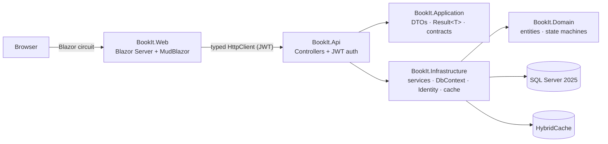

# BookIt

> A resource-booking system — rooms, equipment and services booked by time slot, with
> double-booking prevention, brute-force-hardened auth, and a Blazor UI over a proper Web API.

A portfolio project demonstrating a production-shaped .NET backend: clean layering, EF Core
concurrency/transactions, JWT auth with refresh-token rotation, and security that's on by default.

**Stack:** .NET 10 · ASP.NET Core Web API · EF Core 10 + SQL Server 2025 · ASP.NET Core Identity +
JWT · HybridCache · Blazor Server + MudBlazor · Docker Compose · xUnit. Official Microsoft packages
throughout, with two deliberate exceptions: MudBlazor (UI) and Mapster (DTO mapping).

## Run it

```bash
git clone https://github.com/kuki404/BookIt.git && cd BookIt
cp .env.example .env
docker compose up -d --build
```

Open **http://localhost:5232**, click **Log in → Demo Admin** (or **Demo Customer**) — accounts are
seeded on first run, no typing needed. Runs fully offline: the `.env.example` placeholders are
valid as-is, no cloud account or API keys. A fresh clone always gets a fresh database (the SQL
Server volume is created empty and migrated + seeded on startup); `docker compose down -v` resets it.

## What it demonstrates

**Security — on by default, not bolted on:**

| Concern | Handling |
|---|---|
| Brute-force login | Account locks for 15 min after 5 failed attempts (Identity lockout) |
| Stolen refresh token | Rotated on every use; reusing a rotated token revokes **every** session for that user |
| Endpoint added without an auth decision | `FallbackPolicy = RequireAuthenticatedUser()` — locked by default, `[AllowAnonymous]` is the explicit opt-out |
| Ownership | Resource-based `IAuthorizationHandler` — a customer acts on *their own* bookings only; a role claim isn't enough |
| Abuse | `/api/auth/*` rate-limited to 5 req/min/IP, everything else 200/min/IP |
| Leaked internals | Every unhandled exception → RFC 9457 `ProblemDetails` with a `traceId`, never a stack trace |
| Forged/weak JWTs | Pinned to `HmacSha256`; refuses to start if `Jwt:Secret` is under 256 bits |

**EF Core & performance:** SQL-side projection into DTOs everywhere (never load-then-map);
server-enforced page-size cap (`?pageSize=1000` → `400`, not a 1000-row response); `HybridCache`
+ `OutputCache` on the catalog, tag-invalidated on every write; one compiled query for the
overlap check that runs on every booking; `AddDbContextPool` + filtered composite indexes.

**No repository layer:** services talk to `DbContext` directly and project into DTOs — the `DbSet`
already is a repository and the `DbContext` already is a unit of work.

## Architecture



```
src/
  BookIt.Domain/          Entities, enums, rich domain methods — no framework dependency
  BookIt.Application/     DTOs, Result<T>/PagedResult<T>, contracts, projection expressions
  BookIt.Infrastructure/  DbContext, migrations, services, Identity, JWT, cache, background jobs
  BookIt.Api/             Controllers, auth/rate-limit/CORS/ProblemDetails wiring, health checks
  BookIt.Web/             Blazor Server + MudBlazor
tests/
  BookIt.UnitTests/        Domain state-machine tests
  BookIt.IntegrationTests/ Full auth flow, lockout, refresh-token reuse, resource-based 403s
```

## Tests

```bash
docker compose up -d db     # integration tests run against a real SQL Server
dotnet test
```

Unit tests for domain state machines, plus integration tests (`WebApplicationFactory` against a
real SQL Server, in a separate `BookIt_IntegrationTests` database — never touches dev data).

## Configuration

Two secrets, neither committed to git: `MSSQL_SA_PASSWORD` (local SQL Server SA account) and
`JWT_SECRET` (token signing key, 32+ chars). `docker compose` reads them from `.env` (gitignored,
copied from `.env.example`); running via `dotnet run` reads them from
[User Secrets](https://learn.microsoft.com/aspnet/core/security/app-secrets). Generate real ones
with `openssl rand -base64 24` / `48`. There's no external identity provider — the API signs and
validates its own JWTs, so auth works fully offline.

To run without Docker: start SQL Server (`docker compose up -d db`), set the two values via
`dotnet user-secrets`, then `dotnet run --project src/BookIt.Api` (:5098) and
`src/BookIt.Web` (:5232). CI pipelines for both GitHub Actions
([`.github/workflows/ci.yml`](.github/workflows/ci.yml)) and Azure DevOps
([`azure-pipelines.yml`](azure-pipelines.yml)) are included — both manual-trigger and secret-free
(credentials come from each platform's secret store, never the file).
