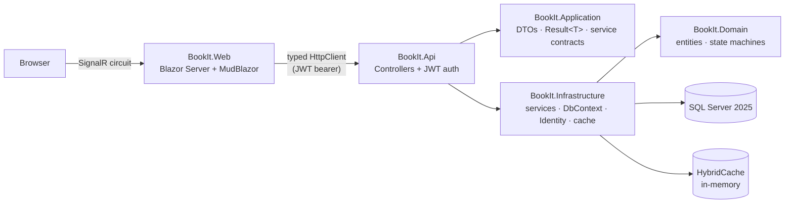

# BookIt

A resource booking system — rooms, equipment or services, booked by time slot, with double-booking
prevention, brute-force-hardened auth, and a Blazor UI on top of a proper Web API.

Built as a portfolio project to demonstrate: ASP.NET Core Web API (Controllers/Actions), EF Core +
SQL Server modeling (concurrency, transactions, projections, paging, caching), JWT auth with
refresh-token rotation and reuse detection, policy- and resource-based authorization, rate
limiting, and a Blazor Server + MudBlazor front end — all on official Microsoft NuGet packages,
plus two named exceptions: **MudBlazor** (UI kit) and **Mapster** (DTO → view-model mapping).

## Try it in 60 seconds

```bash
git clone https://github.com/kuki404/BookIt.git && cd BookIt
cp .env.example .env
docker compose up -d --build
```

Open **http://localhost:5232**, click **Log in**, then **Demo Admin** or **Demo Customer** — no
typing required, both accounts are seeded automatically on first run.

Nothing to register, no cloud account, no API keys: the placeholder values in `.env.example` are
valid as they stand, so a fresh clone runs offline. Replace them with your own before doing
anything beyond a local try — see [Configuration and secrets](#configuration-and-secrets).

## Architecture



No repository layer: `BookIt.Infrastructure/Services` talks to `BookItDbContext` directly and
projects straight into `BookIt.Application` DTOs — the `DbSet` already *is* a repository and the
`DbContext` already *is* a unit of work, so a wrapping interface would only hide the EF Core
features (`AsNoTracking`, SQL-side projection, paging) the code relies on.

## Security

| Concern | How it's handled |
|---|---|
| Brute-force login | `SignInManager.CheckPasswordSignInAsync(..., lockoutOnFailure: true)` — 5 failed attempts locks the account 15 minutes (`AuthController.cs`, `Program.cs`) |
| Stolen refresh token | Rotated on every use; **reuse of an already-rotated token revokes every active session for that user**, not just the replayed one (`AuthController.Refresh`) |
| Brute-force / abuse generally | `/api/auth/*` rate-limited to 5 requests/min/IP; everything else to 200/min/IP (`AddRateLimiter`, `Program.cs`) |
| New endpoint added without thinking about auth | `FallbackPolicy = RequireAuthenticatedUser()` — locked by default, `[AllowAnonymous]` is opt-in, not opt-out |
| Ownership | Resource-based `IAuthorizationHandler` — a Customer token can list/act on *their own* bookings only; role alone isn't enough (`BookingOwnerAuthorizationHandler.cs`) |
| Errors leaking internals | Every unhandled exception → RFC 9457 `ProblemDetails` with a `traceId`, never a stack trace, in any environment (`GlobalExceptionHandler.cs`) |
| Forged/weak JWTs | Pinned to `HmacSha256` only; refuses to start if `Jwt:Secret` is under 256 bits (`Program.cs`) |

## Performance & caching

- **SQL-side projection everywhere**: list/detail queries `.Select()` straight into a DTO
  (`BookingProjections`/`ResourceProjections` in `BookIt.Application/Mapping`) — EF Core generates
  a `SELECT` with only the needed columns, never "load the entity, map it in C# after." Verified:
  ```
  SELECT [r].[Id], [r].[Name], [r].[Description], [r].[Type], [r].[Capacity], [r].[IsActive]
  FROM [Resources] AS [r]
  WHERE [r].[IsActive] = CAST(1 AS bit)
  ORDER BY [r].[Name]
  OFFSET @p ROWS FETCH NEXT @p1 ROWS ONLY
  ```
- **Paging is enforced, not just offered**: `PagedRequest.PageSize` is capped at 100
  server-side — `GET /api/resources?pageSize=1000` is a `400`, not a truncated 1000-row response.
- **`HybridCache`** (official, GA .NET 9+) fronts the resource catalog, tag-invalidated on every
  write — no stale-TTL guessing. **`OutputCache`** sits in front of that for the anonymous listing
  endpoint. Verified with two identical requests:
  ```
  # first call — cache miss, hits the DB
  # second call — served from cache:
  < Age: 0
  ```
- **One compiled query** (`EF.CompileAsyncQuery`) for the overlap check — the single query that
  runs on *every* booking attempt, including retries under lock contention.
- Filtered composite indexes match the exact predicates the hot queries use (see comments in
  `BookIt.Infrastructure/Configurations/*.cs`), and `AddDbContextPool` reuses `DbContext`
  instances instead of allocating one per request.

## Frontend

- Custom teal/indigo MudBlazor theme with a dark/light toggle — starts from the OS preference,
  remembered afterwards (`ThemeService.cs`, `ProtectedLocalStorage`).
- Session survives a hard refresh: the JWT is mirrored into `ProtectedSessionStorage` (encrypted
  via ASP.NET Core Data Protection), restored on the very first render of a new circuit
  (`AuthSession.cs`).
- Skeleton loading states, empty states with a call to action, and a page-level `ErrorBoundary` so
  one broken component doesn't take down the whole circuit.
- Accessibility: skip-to-content link, `aria-label` on every icon-only button, keyboard-navigable
  throughout.
- SEO: per-page `<PageTitle>`/`<HeadContent>` meta description, `robots.txt`, `sitemap.xml`,
  authenticated pages marked `noindex`.

## Project layout

```
src/
  BookIt.Domain/          Entities, enums, rich domain methods (Booking.Confirm()/Cancel()/...) —
                           no EF Core / ASP.NET dependency
  BookIt.Application/     DTOs, Result<T>/PagedResult<T>, service contracts, SQL-projection
                           expressions — no EF Core dependency either, so Web can reference it
  BookIt.Infrastructure/  DbContext, migrations, service implementations (DbContext injected
                           directly — no repositories), Identity, JWT issuing, HybridCache,
                           background jobs
  BookIt.Api/             Web API — Controllers, JWT/rate-limiting/CORS/ProblemDetails wiring,
                           authorization policies + resource-based handler, health checks
  BookIt.Web/             Blazor Server + MudBlazor + Mapster view-models, typed HttpClient
tests/
  BookIt.UnitTests/        Domain state-machine tests (xUnit)
  BookIt.IntegrationTests/ WebApplicationFactory tests against a real SQL Server (xUnit) —
                           auth flow, lockout, refresh-token reuse detection, resource-based 403s
```

Central Package Management (`Directory.Packages.props`) pins every NuGet version in one place;
`Directory.Build.props` turns on .NET analyzers solution-wide with warnings treated as errors.

## Prerequisites

- .NET 10 SDK
- Docker Desktop
- `dotnet-ef` global tool: `dotnet tool install --global dotnet-ef`

## Configuration and secrets

There are exactly **two** secrets in this project, and neither is committed to git:

| Secret | What it is | Rules |
|---|---|---|
| `MSSQL_SA_PASSWORD` | Password for the SA account of your local SQL Server container | SQL Server policy: 8+ characters using upper case, lower case, digits and symbols |
| `JWT_SECRET` | Key this API signs its own tokens with | At least 32 characters (256 bits) — the API refuses to start below that |

Generate real values with:

```bash
openssl rand -base64 24   # MSSQL_SA_PASSWORD
openssl rand -base64 48   # JWT_SECRET
```

**No cloud account is involved anywhere.** The API issues and validates its own JWTs with
HMAC-SHA256 — `JWT_SECRET` is just a random string you invent, and auth works fully offline. There
is nothing to register with Microsoft, Azure AD or Entra ID. (Decoded tokens show a role claim
named `http://schemas.microsoft.com/ws/2008/06/identity/claims/role` — that URI is only .NET's
built-in *naming convention* for claim types, not a call to any Microsoft service.)

Where each value goes depends on how you run the project:

| How you run it | Reads secrets from | How to set them |
|---|---|---|
| `docker compose up` | `.env` in the repo root | `cp .env.example .env`, then edit |
| `dotnet run` locally | [User Secrets](https://learn.microsoft.com/aspnet/core/security/app-secrets) | `dotnet user-secrets set ...` (below) |
| GitHub Actions | Repository secrets | `gh secret set MSSQL_SA_PASSWORD` / `gh secret set JWT_SECRET` |
| Azure DevOps | Library variable group `bookit-ci-secrets` | Pipelines → Library, padlock each variable |

`.env` is gitignored, and User Secrets live outside the repo entirely (`~/.microsoft/usersecrets/`)
— that is what makes your database and signing key yours alone, not shared with anyone who clones
this repository.

> **Why User Secrets and not `.env` for `dotnet run`?** Docker Compose reads `.env` natively, with
> no code. .NET has its own first-party mechanism for the same job, so reading `.env` from C#
> would mean adding a third-party NuGet package for something the framework already does. Both
> paths end up holding the same two values; that duplication is expected.

## First-time setup (running locally with `dotnet run`)

1. Copy `.env.example` to `.env` and put your own values in it (see the table above). The
   placeholders in `.env.example` are valid as-is if you just want it running immediately.

2. Start the database:
   ```bash
   docker compose up -d db
   ```

3. Point the app at your own secrets (User Secrets, not `.env` — see note below):
   ```bash
   dotnet user-secrets set "Sql:Password" "<same password as MSSQL_SA_PASSWORD>" --project src/BookIt.Api
   dotnet user-secrets set "Jwt:Secret" "<same value as JWT_SECRET>" --project src/BookIt.Api
   ```

4. Apply migrations (the app also auto-migrates and seeds demo accounts + resources on startup, so
   this is only needed if you want the schema ready before first run):
   ```bash
   dotnet ef database update --project src/BookIt.Infrastructure --startup-project src/BookIt.Api
   ```

5. Run both apps (separate terminals):
   ```bash
   dotnet run --project src/BookIt.Api    # http://localhost:5098
   dotnet run --project src/BookIt.Web    # http://localhost:5232
   ```

Seeded logins (also available as one-click buttons on the Login page):
**admin@bookit.local / Admin123!** and **customer@bookit.local / Customer123!** — demo accounts
seeded into your own local database, deliberately weak and safe to publish for exactly that reason.

## Running fully in Docker (no local .NET needed to run it)

```bash
docker compose up -d --build
```

Builds and starts **all three services** — `db`, `api`, `web` — from a clean clone, each with a
`HEALTHCHECK` (`/health/ready` on the Api, `/health` on Web) so `depends_on: condition:
service_healthy` actually waits for the app to be able to serve traffic, not just for the process
to start. Same URLs as above.

> SDKs are pinned to an exact patch (`10.0.302`) in both Dockerfiles, not the floating `10.0` tag —
> a later SDK patch was found mid-build to silently drop the Blazor Server client runtime
> (`wwwroot/_framework/blazor.web.js`) from a multi-project publish, breaking all interactivity
> with no build error. Floating tags on a newly-released major version are exactly where that kind
> of regression bites.

## Tests

```bash
docker compose up -d db          # integration tests need a live SQL Server
dotnet test
```

23 tests: domain state-machine unit tests, plus integration tests covering the full auth flow,
account lockout after 5 failed logins, refresh-token reuse detection, resource-based 403s, and
server-enforced pagination limits — all against a separate `BookIt_IntegrationTests` database on
the same SQL Server container (never touches your dev data).

## CI/CD

Both pipelines run the same stages — restore → build → unit tests → integration tests against a
real SQL Server service container → build both Docker images:

- **`.github/workflows/ci.yml`** — GitHub Actions.
- **`azure-pipelines.yml`** — Azure DevOps YAML.

**Neither runs automatically.** GitHub Actions is set to `workflow_dispatch` (manual button only)
and Azure DevOps to `trigger: none`, so nothing builds on push. They are here as reviewable
reference pipelines rather than an always-on build; each file's header comment explains, step by
step, what to change to switch it on.

**Neither file contains a password.** Both read `MSSQL_SA_PASSWORD` and `JWT_SECRET` from their
platform's secret store (see the table in [Configuration and
secrets](#configuration-and-secrets)) — throwaway credentials for an ephemeral container that is
destroyed when the job ends, never the values used locally or for a deployment. The GitHub
workflow additionally runs a `preflight` job that fails with a readable message if those secrets
were never set, instead of dying at "Initialize containers" with an error that says nothing about
secrets.

To enable the GitHub workflow on your own fork:

```bash
gh secret set MSSQL_SA_PASSWORD
gh secret set JWT_SECRET
```

Then uncomment the `push:` / `pull_request:` block at the top of `.github/workflows/ci.yml`.

## Notes

- The SQL Server image is `amd64`; on Apple Silicon it runs emulated via Rosetta — expect a
  slower cold start. `EnableRetryOnFailure()` smooths over transient connection hiccups.
- The database only listens on `127.0.0.1:1433` (see `docker-compose.yml`) — reachable from this
  machine only, never exposed to the local network.
